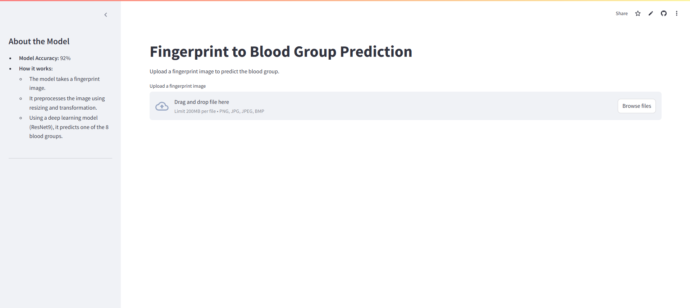

# Fingerprint to Blood Group Prediction

This project leverages deep learning to predict an individual's blood group based on their fingerprint image. The model uses ResNet9 architecture, which is deployed via a Streamlit web application for an intuitive and interactive user experience.

---

## Demo

🎯 [Live Demo: Fingerprint to Blood Group Prediction](https://fingure-print-to-blood-group.streamlit.app/)

---

## Features

- **Easy-to-Use Interface**: Upload a fingerprint image and receive a blood group prediction instantly.
- **High Accuracy**: Achieves 92% accuracy on the test dataset.
- **Supports 8 Blood Groups**:
  - `A+`, `A-`, `B+`, `B-`, `AB+`, `AB-`, `O+`, `O-`
- **Streamlit Frontend**:
  - Responsive and user-friendly.
  - Sidebar explaining the model details and accuracy.
- **Real-time Processing**:
  - Includes a simulated processing spinner for better user interaction.

---

## Screenshot



---

## Installation

### Prerequisites
1. Python 3.8 or above.
2. Required libraries installed (listed in `requirements.txt`).

### Steps
1. Clone the repository:
   ```bash
   git clone https://github.com/Rushabh178/FingurePrintTOBloodGroup.git
   cd FingurePrintTOBloodGroup
   ```

2. Install dependencies:
   ```bash
   pip install -r requirements.txt
   ```

3. Place the pre-trained model file `FingurePrintTOBloodGroup.pth` in the project directory.

4. Run the Streamlit application:
   ```bash
   streamlit run app_resnet.py
   ```

---

## How It Works

### Model Architecture
Here’s a detailed explanation of the `ResNet9` architecture:

---

### **ResNet9 Architecture**

The `ResNet9` model implemented in this project is a compact and efficient variant of the ResNet family of convolutional neural networks (CNNs). ResNet (Residual Network) is widely known for introducing residual connections, which address the issue of vanishing gradients and enable the training of deep networks.

#### **How ResNet9 Works**
The architecture of `ResNet9` is a scaled-down version of ResNet designed to balance model complexity and performance. Below is an explanation of its components:

#### **1. Convolutional Blocks**
The building block of `ResNet9` is a convolutional block, which performs the following:
- **Convolution Layer**: Extracts spatial features using filters.
- **Batch Normalization**: Normalizes the input to stabilize and speed up training.
- **ReLU Activation**: Introduces non-linearity into the network, enabling it to learn complex patterns.
- **MaxPooling (optional)**: Reduces the spatial dimensions to focus on high-level features.

In `ResNet9`, the function `conv_block` constructs these blocks, with an optional pooling layer.

---

#### **2. Residual Connections**
Residual connections are shortcuts that skip one or more layers. They enable the gradient to flow directly through the network, preventing vanishing gradients and allowing the network to be deeper.

In `ResNet9`, residual connections are added after:
- `conv2` and `res1` (residual connection in the first block).
- `conv4` and `res2` (residual connection in the second block).

These residual connections can be mathematically expressed as:

$$
\text{Output} = \text{F(x)} + \text{x}
$$


Where \( F(x) \) represents the transformation applied to the input \( x \).

---

#### **3. Layer-by-Layer Breakdown**
The ResNet9 architecture consists of:
1. **Conv1**: A convolutional block with 64 filters.
2. **Conv2**: A convolutional block with 128 filters and a pooling layer.
3. **Res1**: Two convolutional blocks with 128 filters each, combined with a residual connection.
4. **Conv3**: A convolutional block with 256 filters and a pooling layer.
5. **Conv4**: A convolutional block with 512 filters and a pooling layer.
6. **Res2**: Two convolutional blocks with 512 filters each, combined with a residual connection.
7. **Classifier**:
   - Adaptive Max Pooling: Reduces the spatial dimensions to 1x1.
   - Flatten: Converts the 3D tensor into a 1D vector.
   - Dropout: Prevents overfitting by randomly disabling some neurons during training.
   - Fully Connected Layer: Maps the features to the number of output classes (8 blood groups in this case).

---

#### **4. Model Summary**
- **Input**: RGB image of size $$\( 128 \times 128 \)$$.
- **Output**: A probability distribution across 8 classes (blood groups).
- **Number of Parameters**: Optimized to balance performance and computational efficiency.
- **Activation Function**: ReLU for intermediate layers, softmax (implicit in cross-entropy loss) for output probabilities.

---

#### **Why ResNet9?**
- **Compact Design**: ResNet9 is smaller than standard ResNet architectures (e.g., ResNet18 or ResNet34), making it suitable for scenarios with limited computational resources.
- **Residual Learning**: It leverages residual connections to ensure stable and efficient training.
- **High Accuracy**: Despite its compact size, ResNet9 achieves high accuracy on image classification tasks due to its carefully designed layers.

---

### **Diagram of ResNet9**
Here’s a conceptual visualization of the ResNet9 architecture:

```
Input (3 x 128 x 128)
     ↓
Conv1 (64 filters)
     ↓
Conv2 (128 filters + MaxPooling)
     ↓
Res1 (Residual Block with 128 filters)
     ↓
Conv3 (256 filters + MaxPooling)
     ↓
Conv4 (512 filters + MaxPooling)
     ↓
Res2 (Residual Block with 512 filters)
     ↓
Classifier (Adaptive Pooling → Flatten → Dropout → Fully Connected)
     ↓
Output (8 classes)
```

---

### **Usage in the Project**
In this project, `ResNet9` is used to classify fingerprint images into 8 different blood groups. The pre-trained weights are loaded, and the model is used in evaluation mode to predict the blood group from an uploaded image.

--- 

### Steps
1. **Image Upload**:
   - Users upload a fingerprint image in formats like PNG, JPG, JPEG, or BMP.

2. **Preprocessing**:
   - The image is resized to 128x128 pixels and normalized for model compatibility.

3. **Prediction**:
   - The model processes the image and predicts the blood group among 8 possible classes.

4. **Output**:
   - The result is displayed on the screen, along with the uploaded fingerprint.

---

## Files

- `app_resnet.py`: Main script for the Streamlit application.
- `FingurePrintTOBloodGroup.pth`: Pre-trained weights for the ResNet9 model.
- `requirements.txt`: Python dependencies.

---

## Dependencies

- PyTorch
- torchvision
- Streamlit
- Pillow
- Other libraries (see `requirements.txt`).

---

## Usage

### Uploading a Fingerprint
1. Open the [live app](https://fingure-print-to-blood-group.streamlit.app/).
2. Drag and drop or browse to upload a fingerprint image.
3. Wait for the processing to complete and view the predicted blood group.

---

## Contributing

Contributions are welcome! Feel free to fork this repository, make updates, and submit a pull request.

---

## Acknowledgments

- **PyTorch**: For providing the deep learning framework.
- **Streamlit**: For the seamless deployment of the web application.
